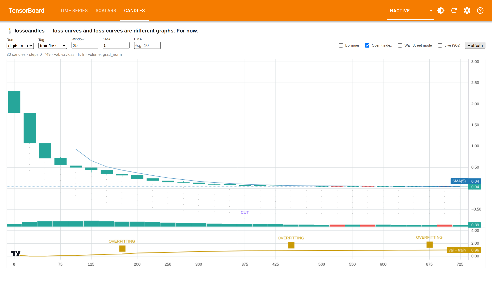

# losscandles 🕯️📉

> Loss curves and loss curves are different graphs. **For now.**

A real TensorBoard plugin that renders your PyTorch / TensorBoard training loss
as OHLC candlestick charts — with moving averages, Bollinger bands, an
overfitting oscillator, and circuit breakers. Your model is an asset. Watch it
trade.


-green)




---

## Why

Training loss is a time series. Finance solved time-series visualization in
the 1700s, when a rice trader in Osaka invented the candlestick chart. Machine
learning has been drawing the same blue matplotlib line since 2015.

An entire industry feeds candlestick charts *into* neural networks to predict
markets. **Nobody has fed the neural network back out into a candlestick
chart.** The arbitrage was wide open. We took the trade.

This is not a workaround, a logging-charts-as-images hack, or an offline HTML
file cosplaying as a webapp. It's a real dynamic TensorBoard plugin with its
own "Candles" tab, reading your scalars live through TensorBoard's own data
provider — the exact plumbing SCALARS and TIME SERIES use. We just gave it a
Bloomberg terminal instead of a blue line.

## Install (local build — we're not listed on any exchange)

There is no `pip install losscandles`. This ticker doesn't trade anywhere
public, which is either an anti-rug-pull guarantee or a red flag depending on
your priors:

```bash
git clone https://github.com/Cosxin/losscandles.git
cd losscandles
pip install .
```

Want the drop-in `torch` writer (epoch gridlines, a declared volume tag,
halt-on-NaN)?

```bash
pip install ".[torch]"
```

*Past performance of this model does not guarantee convergence. Not financial
advice.*

## Quickstart

**Zero-instrumentation** — point it at any logdir written by plain
`SummaryWriter.add_scalar`. No code changes, no SDK key, no seed round:

```bash
python -m losscandles.demo        # generates a synthetic run under runs/demo
tensorboard --logdir runs         # opens with a "Candles" tab, no plugin config needed
```

Longer real runs may want a higher TensorBoard sampling cap — see
[Order book depth](#order-book-depth-aka-sampling) below.

**Drop-in writer** — change one import, keep your training loop, and unlock
epoch gridlines, a declared volume tag, and a big red HALT button for the day
your loss discovers NaN:

```python
from losscandles.torch import LossCandlesWriter as SummaryWriter

writer = SummaryWriter("runs/exp42")
for step, batch in enumerate(loader):
    loss = train_step(batch)
    writer.add_scalar("train/loss", loss, step)
    # nothing else required — the plugin renders candles from this alone.

# entirely optional enrichment:
writer.add_epoch_boundary(step)     # epoch gridlines on the chart
writer.set_volume_tag("grad_norm")  # volume bars aggregate this, not point-count
```

Volume bars default to point-count per candle, which is flat and uninformative
if you log at a constant cadence (the usual case). If a `grad_norm`-ish,
`tokens/sec`-ish, or `samples/sec`-ish tag exists in the run, the plugin uses
that automatically — no `set_volume_tag()` required. Explicit `set_volume_tag`
always wins if you've called it.

`torch` is only required for `losscandles.torch` — the plugin itself has no
torch dependency and works with any framework that writes standard
TensorBoard scalar summaries: PyTorch, JAX, Keras, or a `for` loop and a dream.

## Reading the chart

| Candle | Meaning |
|---|---|
| 🟩 Green | Close < Open. Loss fell. **Bullish for the model.** |
| 🟥 Red | Close > Open. Loss rose. Someone touched the learning rate. |
| Long upper wick | A batch you should apologize to |
| Doji | The optimizer is thinking about it |

Yes, green-means-down is inverted from finance. Loss going down *is* the bull
case. Purists can check **Wall Street mode** to flip it and feel worse.

## Indicators

| Control | What it does | What it's called on the trading floor |
|---|---|---|
| SMA / EMA fields | Moving averages over candle closes | "The trend is your friend" |
| Bollinger checkbox | Rolling mean ± 2σ bands | Training volatility |
| Overfit index checkbox | Shades regions where val rises while train falls, 3+ candles running | The RSI of ML. Overbought = overfit |
| *(always on)* | NaN/Inf detected in a candle | 🛑 **CIRCUIT BREAKER HALT** |
| *(always on)* | Close jumps >30% in one candle | 🔴 **S** (sell signal, standard B/S notation) |
| *(always on)* | Learning-rate drop detected (`lr` tag) | 🏛️ **RATE CUT** |

All three "always on" annotations, plus epoch gridlines, work on any logdir —
no `losscandles.torch` required.

## Order book depth (a.k.a. sampling)

TensorBoard's own market makers cap scalar ingestion at ~1000 points per tag
by default, which can quietly truncate candles on long runs — thin liquidity,
wide spreads, missing candles. For full-resolution charts on larger runs:

```bash
tensorboard --logdir runs --samples_per_plugin scalars=100000
```

The bundled demo run is sized to stay under the default cap, so `tensorboard
--logdir runs` alone is enough to see it at full depth.

## Backward compatibility (since the 2000s)

losscandles has been regression-tested against every major regression. If it
went down and to the right — or up, catastrophically — we render it.

| Era | Format | Status |
|---|---|---|
| 2026 | TensorBoard event files (TF2 / PyTorch) | ✅ Native |
| 2015–2019 | TF 1.x event files | ✅ Supported, like all legacy debt |
| pre-2015 | CSV of (step, loss) | ✅ If you logged it, we chart it |
| 2008 | ABX subprime index | ✅ Our integration test. Still painful to open |
| 2000 | NASDAQ Composite | ✅ Same OHLC engine — point it at any scalar series |
| 1929 | Ticker tape | ⚠️ Requires OCR and a strong constitution |
| 1637 | Tulip futures | ❌ `wontfix` — no survivors left to file issues |

Every crash is a loss curve if you hold it right. Python 2 support ended the
same way the housing market did: officially in 2008, actually in 2020,
emotionally never.

## FAQ

**Is this financial advice?**
No.

**Is my loss going to converge?**
Past performance does not guarantee future results. It is, however, 100% of
the training data.

**Can I short my own training run?**
Yes. It's called early stopping.

**My chart shows a head-and-shoulders pattern. Should I be worried?**
In finance that predicts a reversal. In ML it predicts you forgot to shuffle
the dataloader.

**What happens at NaN?**
Trading halts. A black marker goes up on the chart. A moment of silence is
observed. Restart from checkpoint like the Fed restarts liquidity: quietly,
and pretending it was the plan.

## Development (for masochists who want to help)

```bash
pip install -e ".[dev,torch]"
pytest                                          # unit + WSGI route + entry-point tests
cd frontend && npm install && npm run build     # rebuild static/index.js after editing src/index.ts
```

Pull requests are welcome and will be reviewed with exactly the rigor you'd
expect for a candlestick chart of a number that only goes down. Bug fixes and
joke improvements are weighted equally.

## Roadmap

- [ ] `--ticker`: ASCII candles scrolling in your terminal like a Bloomberg
      feed, so you can watch epoch 12 the way God and CNBC intended
- [ ] Weights & Biases adapter
- [ ] Earnings-call mode: the model reads its own chart and generates forward
      guidance it will not meet

## License

MIT. Free as in "the money used to be."

---

*losscandles is satire that compiles. Charts may go down as well as up — with
this tool, that's the goal. Not affiliated with any exchange, index, or
entity that is too integrated to unplug.*
